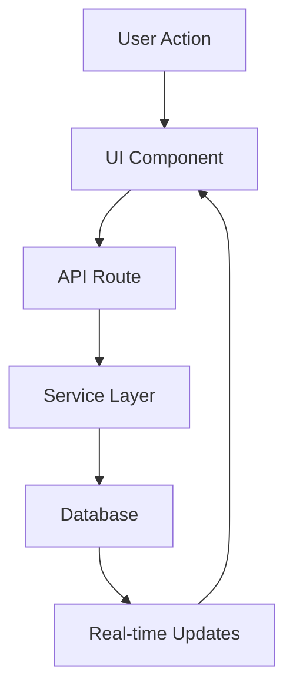

# Technical Implementation Plan

## Phase 1: Data Structure Enhancement

### 1. Database Schema Implementation
```sql
-- Key tables to implement:
deal_stages_history
interactions
communication_logs
deal_outcomes
contact_engagement
deal_scores
```

#### Implementation Steps:
1. **Backup Current Data**
   ```bash
   pg_dump -U postgres -d your_db_name > backup.sql
   ```

2. **Run Migrations**
   ```bash
   psql -U postgres -d your_db_name -f migrations/20240320_ai_prerequisites.sql
   ```

3. **Verify Schema**
   ```sql
   \d+ deal_stages_history
   \d+ interactions
   \d+ communication_logs
   ```

### 2. Service Layer Implementation

#### DealHistoryService
```typescript
class DealHistoryService {
  // Core methods
  async trackStageChange(dealId: string, fromStage: string, toStage: string)
  async getDealTimeline(dealId: string)
  async getStageHistory(dealId: string)
  async addHistoryNote(dealId: string, note: string)
}
```

#### InteractionService
```typescript
class InteractionService {
  // Core methods
  async logInteraction(data: CreateInteractionDto)
  async getInteractions(filters: InteractionFilters)
  async updateInteraction(id: string, data: UpdateInteractionDto)
  async deleteInteraction(id: string)
}
```

#### CommunicationService
```typescript
class CommunicationService {
  // Core methods
  async logCommunication(data: CreateCommunicationDto)
  async getCommunicationHistory(filters: CommunicationFilters)
  async updateCommunicationStatus(id: string, status: CommunicationStatus)
}
```

#### EngagementService
```typescript
class EngagementService {
  // Core methods
  async calculateEngagement(contactId: string)
  async updateEngagementScore(contactId: string)
  async getEngagementMetrics(contactId: string)
  async trackEngagementEvent(event: EngagementEvent)
}
```

### 3. API Routes Implementation

#### Deal History
```typescript
// /api/deals/[id]/history
export async function GET(request: NextRequest, { params }: { params: { id: string } }) {
  const dealHistoryService = new DealHistoryService();
  const history = await dealHistoryService.getDealTimeline(params.id);
  return NextResponse.json({ data: history });
}
```

#### Interactions
```typescript
// /api/interactions
export async function POST(request: NextRequest) {
  const interactionService = new InteractionService();
  const data = await request.json();
  const interaction = await interactionService.logInteraction(data);
  return NextResponse.json({ data: interaction }, { status: 201 });
}
```

#### Communications
```typescript
// /api/communications
export async function GET(request: NextRequest) {
  const { searchParams } = new URL(request.url);
  const filters = {
    contactId: searchParams.get('contactId'),
    dealId: searchParams.get('dealId'),
    channel: searchParams.get('channel'),
    startDate: searchParams.get('startDate'),
    endDate: searchParams.get('endDate'),
  };
  
  const communicationService = new CommunicationService();
  const communications = await communicationService.getCommunicationHistory(filters);
  return NextResponse.json({ data: communications });
}
```

## Phase 2: UI Components

### 1. Interaction Recording

```typescript
// components/interactions/InteractionForm.tsx
export function InteractionForm({ onSubmit }: InteractionFormProps) {
  return (
    <form onSubmit={handleSubmit}>
      <Select
        name="type"
        options={interactionTypes}
        label="Interaction Type"
      />
      <Input
        name="content"
        label="Notes"
        multiline
      />
      <Button type="submit">Save Interaction</Button>
    </form>
  );
}
```

### 2. Communication Logger

```typescript
// components/communications/CommunicationLogger.tsx
export function CommunicationLogger({ contactId, dealId }: LoggerProps) {
  return (
    <div>
      <Select
        name="channel"
        options={communicationChannels}
      />
      <Input
        name="subject"
        label="Subject"
      />
      <RichTextEditor
        name="content"
        label="Message Content"
      />
      <Button onClick={handleLog}>Log Communication</Button>
    </div>
  );
}
```

### 3. Timeline Component

```typescript
// components/timeline/DealTimeline.tsx
export function DealTimeline({ dealId }: TimelineProps) {
  return (
    <div className="timeline">
      {events.map(event => (
        <TimelineEvent
          key={event.id}
          event={event}
        />
      ))}
    </div>
  );
}
```

### 4. Engagement Dashboard

```typescript
// components/engagement/EngagementMetrics.tsx
export function EngagementMetrics({ contactId }: MetricsProps) {
  return (
    <div className="metrics-grid">
      <ScoreCard
        title="Engagement Score"
        value={score}
        trend={trend}
      />
      <InteractionChart data={interactionHistory} />
      <ResponseMetrics data={responseData} />
    </div>
  );
}
```

## Data Flow Architecture



## Implementation Order

1. **Week 1**
   - Database schema implementation
   - Basic service layer setup
   - Initial API routes

2. **Week 2**
   - Complete service implementations
   - API route enhancement
   - Basic UI components

3. **Week 3**
   - UI component completion
   - Integration testing
   - Performance optimization

4. **Week 4**
   - Mobile responsiveness
   - Documentation
   - Final testing and deployment

## Testing Strategy

1. **Unit Tests**
   - Service methods
   - UI components
   - Utility functions

2. **Integration Tests**
   - API endpoints
   - Database operations
   - Service interactions

3. **E2E Tests**
   - User workflows
   - Data consistency
   - UI interactions

## Monitoring and Metrics

1. **Performance Metrics**
   - API response times
   - Database query times
   - UI render performance

2. **Error Tracking**
   - API errors
   - UI exceptions
   - Database issues

3. **Usage Analytics**
   - Feature adoption
   - User engagement
   - Error rates

## Deployment Strategy

1. **Pre-deployment**
   - Database backups
   - Feature flags setup
   - Rollback plan

2. **Deployment Steps**
   - Database migrations
   - Service deployment
   - UI deployment

3. **Post-deployment**
   - Monitor metrics
   - User feedback
   - Performance analysis

This technical implementation plan provides a structured approach to building the prerequisite functionality needed for AI features. Each component is designed to be modular and scalable, allowing for future enhancements and AI integration.